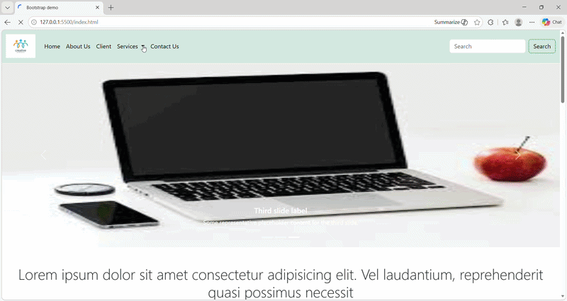
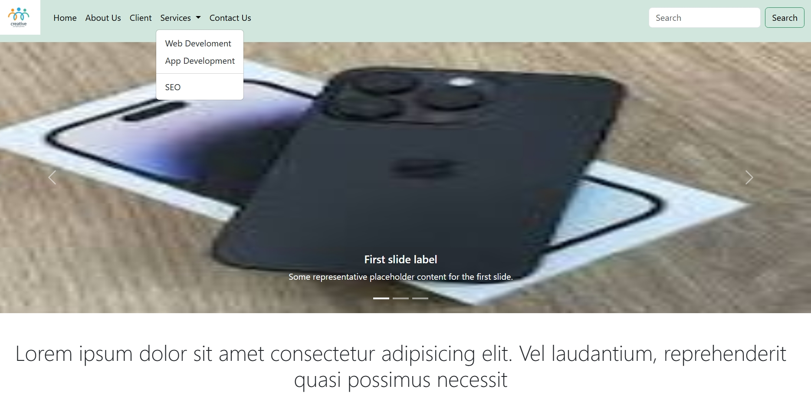
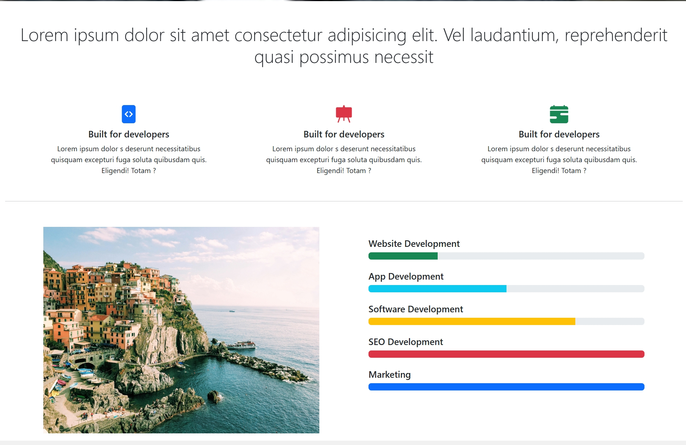
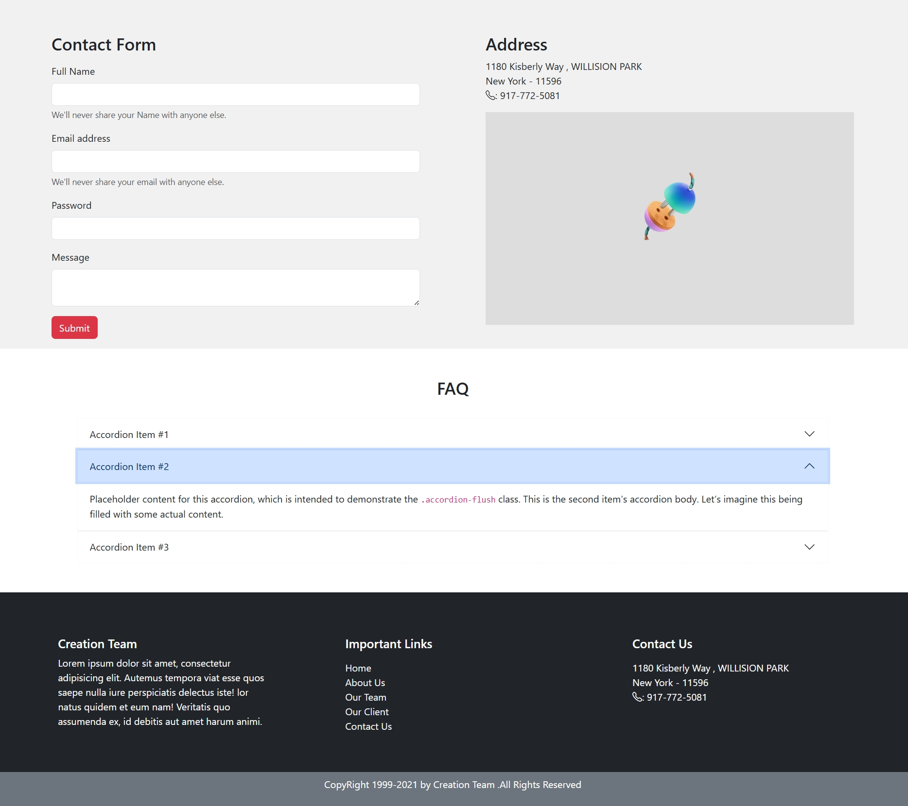
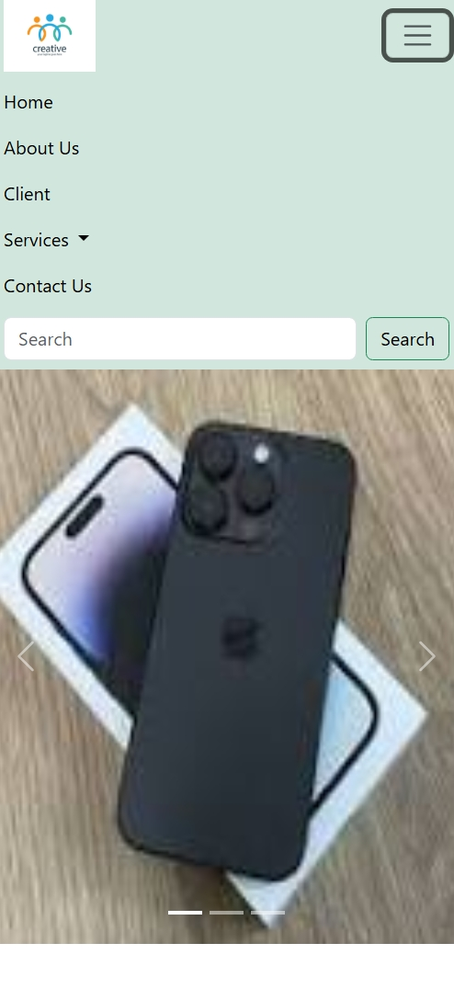

# 🎨 Bootstrap UI Project


A modern and responsive **UI Design Project** built using **Bootstrap, HTML5, and CSS3**, focused on creating clean layouts and reusable UI components.

---

## 🚀 Live Demo

🌐 **Live Website:** https://khushi-66.github.io/BootStrap-ui-1/

📂 **GitHub Repository:** https://github.com/khushi-66/BootStrap-ui-1

---

## 🎥 Live Preview



---

## 📌 Overview

This project demonstrates the use of **Bootstrap framework** to build responsive and visually appealing user interfaces efficiently.

It highlights strong fundamentals of:

* Layout structuring
* Component-based UI design
* Responsive web development

---

## 📸 Screenshots

### 🏠 Home Section



### 🧩 UI Components



### 📊 Contact Section



### 📱 Mobile View



---

## ✨ Features

* 📱 Fully responsive design (mobile-first approach)
* 🎨 Pre-styled Bootstrap components
* ⚡ Fast and clean UI implementation
* 🧩 Reusable UI sections
* 🧭 Structured layout with grid system

---

## 🛠️ Tech Stack

| Technology      | Usage          |
| --------------- | -------------- |
| **HTML5**       | Structure      |
| **CSS3**        | Custom Styling |
| **Bootstrap**   | UI Framework   |
| **Grid System** | Layout Design  |

---

## 🌐 Deployment

This project is deployed using **GitHub Pages**.

### 🚀 Deployment Process:

* Uploaded project to GitHub repository
* Enabled **GitHub Pages** from repository settings
* Selected main branch for deployment
* Project is live and accessible via public URL

---

## 📂 Project Structure

```bash
BootStrap-ui-1/
│── index.html
│── style.css
│── screenshots/
│── assets/
│── README.md
```

---

## ⚙️ Installation & Setup

### 1️⃣ Clone the repository

```bash
git clone https://github.com/khushi-66/BootStrap-ui-1.git
```

### 2️⃣ Navigate to project folder

```bash
cd BootStrap-ui-1
```

### 3️⃣ Open in browser

Simply open `index.html` in your browser 🚀

---

## 📈 Future Improvements

* 🎨 Advanced animations (AOS / Framer Motion)
* 🌙 Dark mode support
* 🧠 More reusable UI components
* 🔗 Backend integration

---

## 👩‍💻 Author

**Khushi Sahu**
🔗 https://github.com/khushi-66

---

## ⭐ Support

If you like this project, give it a ⭐ on GitHub!
